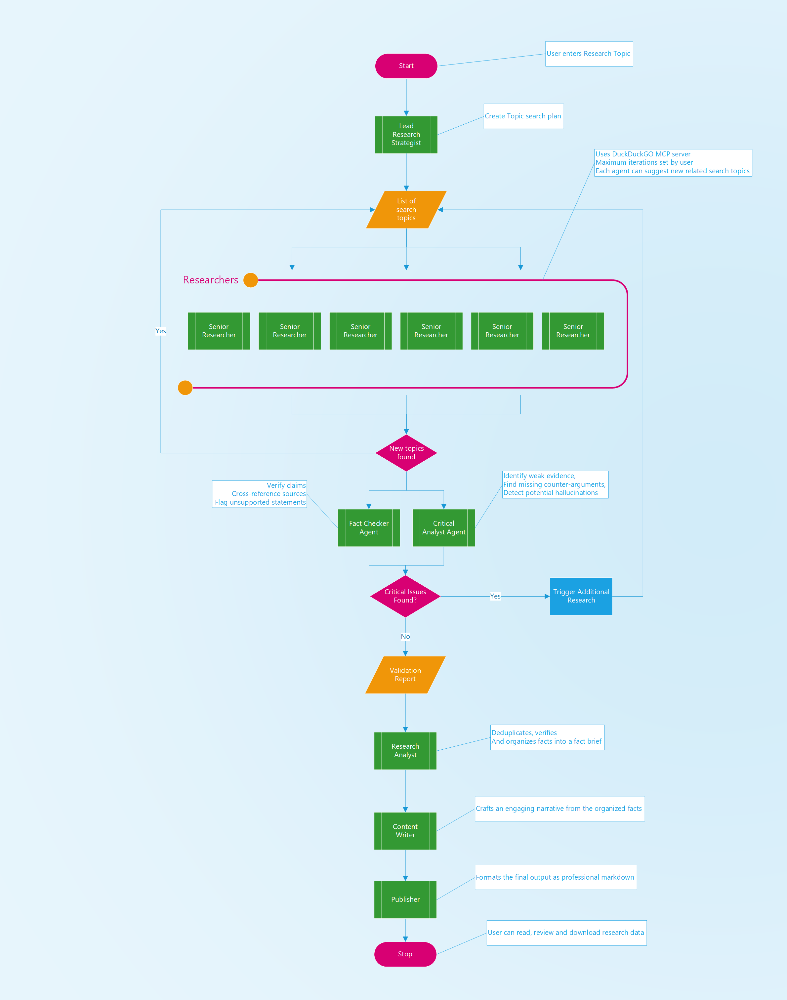

# ResearchAssistant Crew

Welcome to my Deep Research Assistant Crew! Design to help you with you research tasks. 

## Agentic Workflow
The flow diagram below maps the full Agentic Worflow:

- User inputs a Research Topic
- Lead Research Strategist breaks down the topic into a search plan
- The list of search topics is then passed to a team of Researchers who each uses a DuckDuckGo MCP server to search the web and collect relevant information. The Researchers can also create new search topics. which get added to the search plan.
- Once all searches are complete and no new search topics are created, the results are passed to the "fact checker" and the "critical analysis" agents.
- The Fact Checker agent checks the search results to verify the information, cross-reference sources and flag unspported statements.
- The Critical Analysis agent checks the search results to evaluate the quality of the information, identify gaps in reasoning, and ensure balanced perspectives. It identifys weak evidence, missing counter-arguments and detects potential hallucinations.
- Any issues flagged are passed back to the Lead Research Strategist who can then modify the search plan and re-run the research.
- If issues aren't flagged, the search results are then passed to the "research analyst" who uses it to remove any duplicates, and organise the information into a Fact Brief.
- The Fact brief is passed on to a "Content Writer" whih crafts an engaging narrative based on the fact sheet.
- Finally the publisher takes the content and formats it into a professional Markdown document and prepares it for distribution.




## Installation

Ensure you have Python >=3.10 <3.14 installed on your system. This project uses [UV](https://docs.astral.sh/uv/) for dependency management and package handling, offering a seamless setup and execution experience.

First, if you haven't already, install uv:

```bash
pip install uv
```

Next, navigate to your project directory and install the dependencies:

(Optional) Lock the dependencies and install them by using the CLI command:
```bash
crewai install
```
### Customizing

**Add your `OPENAI_API_KEY` into the `.env` file**

- Modify `src/research_assistant/config/agents.yaml` to define your agents
- Modify `src/research_assistant/config/tasks.yaml` to define your tasks
- Modify `src/research_assistant/crew.py` to add your own logic, tools and specific args
- Modify `src/research_assistant/main.py` to add custom inputs for your agents and tasks

## Running the Project

To kickstart your crew of AI agents and begin task execution, run this from the root folder of your project:

```bash
$ crewai run
```

This command initializes the Research_Assistant Crew, assembling the agents and assigning them tasks as defined in your configuration.

This example, unmodified, will run the create a `report.md` file with the output of a research on LLMs in the root folder.

## Understanding Your Crew

The Research_Assistant Crew is composed of multiple AI agents, each with unique roles, goals, and tools. These agents collaborate on a series of tasks, defined in `config/tasks.yaml`, leveraging their collective skills to achieve complex objectives. The `config/agents.yaml` file outlines the capabilities and configurations of each agent in your crew.

## Support

For support, questions, or feedback regarding the ResearchAssistant Crew or crewAI.
- Visit our [documentation](https://docs.crewai.com)
- Reach out to us through our [GitHub repository](https://github.com/joaomdmoura/crewai)
- [Join our Discord](https://discord.com/invite/X4JWnZnxPb)
- [Chat with our docs](https://chatg.pt/DWjSBZn)

Let's create wonders together with the power and simplicity of crewAI.

---

## CLI and API Usage

The research assistant can be used programmatically via CLI or API for automation and integration.

### CLI Usage

Run research directly from the command line:

```bash
uv run research --topic "Your research topic" --depth normal --output ./results
```

**Options**:
- `--topic` (required): Research topic
- `--depth` (optional): `fast`, `normal`, or `deep` (default: `normal`)
- `--output` (optional): Output directory (default: `Research`)

**Examples**:

```bash
# Basic research
uv run research --topic "AI trends 2025"

# Deep research with custom output
uv run research --topic "Quantum computing" --depth deep --output ./my_research

# Fast research
uv run research --topic "Climate tech" --depth fast
```

### API Usage

Start research programmatically via REST API:

**Endpoint**: `POST /api/start-research`

**Request**:
```bash
curl -X POST http://localhost:5000/api/start-research \
  -H "Content-Type: application/json" \
  -d '{"topic": "AI trends 2025", "depth": "deep", "outputPath": "./results"}'
```

**Response**:
```json
{
  "status": "started",
  "message": "Research initiated"
}
```

### Depth Modes

| Mode | Topics | Iterations | Researchers | Use Case |
|------|--------|------------|-------------|----------|
| **fast** | 5 | 1 | 2 | Quick overview |
| **normal** | 10 | 3 | 3 | Balanced (default) |
| **deep** | 20 | 5 | 5 | Comprehensive research |

### Integration Examples

**Python**:
```python
import requests

response = requests.post(
    'http://localhost:5000/api/start-research',
    json={'topic': 'AI trends 2025', 'depth': 'deep'}
)
print(response.json())
```

**Bash Script**:
```bash
#!/bin/bash
topics=("AI trends" "Quantum computing" "Climate tech")
for topic in "${topics[@]}"; do
  uv run research --topic "$topic" --depth normal
done
```

For detailed API and CLI documentation, see [API_CLI_USAGE.md](./API_CLI_USAGE.md).

